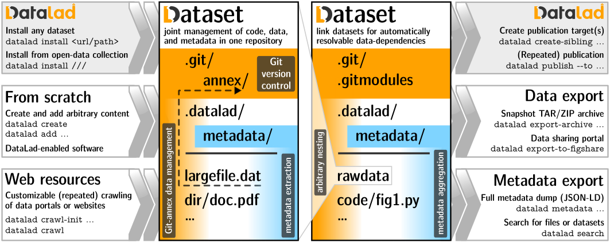

# Summary

The DataLad project (http://datalad.org) adapted the models of open-source software development and distribution to address technical limitations of today's data management, sharing, and provenance collection.
Born of idea to provide a unified data distribution for neuroscience, taking a versatile system for data logistics 
(git-annex, https://git-annex.branchable.com) built on top of the most popular distributed version control system 
(git, https://git-scm.com), and adopting ideas and procedures from software distributions, DataLad delivers a completely open, pioneering platform for flexible decentralized research data management (dRDM) [@Hanke_2021].

# Statement of Need

Code, data, and computing environments are at the core of scientific practice, and unobstructed access and efficient management of all those digital objects promotes scientific discovery through collaboration, reproducibility, and replicability. 
While code management and sharing is streamlined with the advance of software distributions, distributed version control systems, and social coding portals like GitHub, data has remained a “2nd-class citizen” in the contemporary scientific process, despite FAIR principles postulating demands on public data hosting portals and the big callout for Data Science.
Disconnected FAIR data hosting portals provide a cacophony of data access and authentication methods, data versioning is frequently ignored, and shared data provenance is often not recoverable simply because data management is rarely considered to be an integral part of the scientific process.

## Why git and git-annex

Git is an excellent distributed content management system geared toward management and collaboration on text files, and as such cannot handle large or binary files well.
Moreover, any data committed to git becomes available to all clones of that repository, thus making it hard or impossible to provide distributed storage of managed data, or revocation of individual files from distribution.  
Git-annex takes advantage of git for management of textual information to overcome git's limitation in management of individual files (be it a large data file or a sensitive data) content.
A file managed by git-annex is replaced with a symbolic link pointing to the content of the file as identified by its content checksum, and only such light-weight link is directly committed into git.
Git-annex then manages files availability information in any local repository, or other git remotes or external resources, e.g. web urls.
Such simple approach allows git-annex to scale to manage virtually arbitrarily large files, and "link" files in a git repository to vast data resources available online. 

## Why git and git-annex alone are not enough

**They are generic and might lack support for domain specific solutions.** 
git can interact with other repositories on the file system or accessible via a set of standard (ssh, http) or custom (git) network transport protocols.
Interaction with non-git aware portals, should then be implemented via custom git transfer protocols, as e.g. was done in git-remote-rclone [TODOREF].
git-annex provides access to a wide range of external data storage resources via a wide range of protocols, but cannot implement all idiosyncracies of any individual data portal. 
To address demands of DataLad to access data available from compressed archives and specialized servers (such as XNAT), git-annex implemented support for external special remotes [@git-annex:special_remotes_protocol].
This allowed DataLad and many other projects to provided git-annex special 
remotes to facilitate access to an ever growing collection of resources [@git-annex:special_remotes] and to overcome technological limitations (e.g., maximal file sizes, or file system inodes limits).

**They require a layer above to establish a *distribution*.**
DataLad project's initial goal was to provide a data distribution with unified access to the already available public data archives in neuroscience, such as http://crcns.org, http://openfmri.org, etc. 
git and git-annex are just "client tools" and on their own do not provide aggregation of different resources into a unified distribution.
http://datasets.datalad.org became an example of such a data distribution curated by DataLad team, which at the moment provides access to over 250 TBs of data across wide range of projects and archives.  

**Modularization is needed to scale.**
Research workflows impose additional demands for an efficient research data management (RDM) platform besides "version control" and "data transport".
Many research datasets contain millions of files, and that precludes placing such datasets in their entirety within a single git repository even if files are tiny in their size.
Such datasets should be partitioned into smaller subdatasets (e.g., a subdataset per each subject in the dataset comprising thousands of participants).
Such modularization allows for not only scalable management, but also for the efficient reuse of a selected subset of datasets.
DataLad uses standard "git submodules" mechanism to unambiguously link (versions of) individual datasets into larger super-datasets, and further simplifies working with such hierarchies of datasets.
DataLad makes it trivial to operate on individual files deep in the hierarchy or entire sub-trees of datasets.

**They do not necessarily facilitate the best scientific workflow.**
git and git-annex, being generic tools, come with rich interfaces and allow for a wide range of workflows.
DataLad strives to provide higher level interface to more efficiently (than direct invocation of individual git and git-annex commands) cover typical use cases encountered in the scientific practice, and to encourage efficient computation and reproducibility.
DataLad is accompanied by rich documentation [@datalad-handbook:zenodo] to guide a scientist of any technological competency level, and agnostic of the field of science.

# Overview of the DataLad and its ecosystem

## DataLad core

`datalad` Python package provides both a Python library and a command line tool which expose core DataLad functionality to fulfill a wide range of dRDM use cases for any field of endeavor (see Figure 1).
Its API (see \autoref{fig:one}) operates on DataLad datasets which are just git (with optional git-annex for data) repositories with additional metadata and configuration.
 

Based on built-in mechanism of git submodules, DataLad embraces and simplifies modular composition of smaller datasets into a larger (super)datasets.
With this simple paradigm, DataLad fulfills YODA principles [@yoda:myyoda] and facilitates efficient access, composition, scalability, reuse, sharing, and reproducibility of results  (see Figure 2).

As a testament of scalability, http://datasets.datalad.org provides a DataLad (super)dataset encapsulating thousands of datasets and providing unified access to over 250 TBs of primarily neural data from a wide range of hosting portals. 

## Extensions

Similarly to git and git-annex, DataLad core strives to provide a generic, not encumbered by a specific field of science platform.
To harmoniously extend its functionality, DataLad provides mechanism for providing domain or technology specific extensions.
Exemplar extensions:

- [datalad-container](https://github.com/datalad/datalad-container) [@datalad-container:zenodo] to simplify management and use of Docker and Singularity containers typically containing complete computational environments;
- [datalad-crawler](https://github.com/datalad/datalad-crawler) [@datalad-crawler:zenodo] the functionality which initiated the DataLad project - support for creating and updating DataLad datasets from external resources;
- [datalad-neuroimaging](https://github.com/datalad/datalad-neuroimaging) [@datalad-neuroimaging:zenodo] to provide neuroimaging specific procedures and metadata extractors
- [datalad-osf](https://github.com/datalad/datalad-osf/) [@datalad-osf:zenodo] to collaborate using DataLad through the Open Science Framework (OSF).

The same mechanism of extensions is used for rapid development of new functionality to later be moved into the main DataLad codebase 
(e.g., [datalad-metalad](https://github.com/datalad/datalad-metalad/)).
https://github.com/datalad/datalad-extensions/ repository provides a list of extensions and contineous integration testing of their released versions against released and development versions of the DataLad core. 

## External uses and integrations

TODO: probably here cite some examples of scientific papers in the wild which used DataLad

DataLad can be used as an independent tool, or as a core technology behind a larger platform.
[OpenNeuro](http://openneuro.org) uses DataLad for data logistics with data deposition to a public S3 bucket.
[CONP-PCNO](https://github.com/CONP-PCNO/) adopts aforementioned modular composition to deliver a rich collection of datasets with public or restricted access to data.
[ReproMan](http://reproman.repronim.org) integrates with DataLad to provide version control and data logistics.
https://www.datalad.org/integrations.html provides a more complete list of DataLad usage and integration with other projects, and @Hanke_2021 provides a systematic depiction of DataLad as a dRDM used by a number of projects. 

## Documentation

DataLad core repository populates [docs.datalad.org](http://docs.datalad.org/en/latest/) with developers oriented information and detailed description of command line and Python interfaces. 
A comprehensive [DataLad Handbook](http://handbook.datalad.org) [@datalad-handbook:zenodo] provides documentation with numerous usage examples oriented toward novice and advanced users of all backgrounds.

The simplest "prototypical" example is `datalad search haxby` which would install the http://datasets.datalad.org superdataset, and search for datasets mentioning `haxby` anywhere in their metadata records.
Any reported dataset could be immediately installed using `datalad install` command, and data files of interest obtained using `datalad get`.

## Installation

DataLad Handbook provides [installation instructions](http://handbook.datalad.org/en/latest/intro/installation.html) for all operating systems.
DataLad releases are distributed through PyPI, Debian, NeuroDebian, brew, conda-forge.
[datalad-installer](https://github.com/datalad/datalad-installer/) (also available from PyPI) can be used to streamline installation of `git-annex` which is a dependency of the DataLad, and thus cannot be installed via `pip`. 

## Development

DataLad is being developed openly in a public https://github.com/datalad/datalad repository.
Issue tracker, labels, milestones, and pull requests (from personal forks) are used to coordinate development.
DataLad heavily relies on versatility and stability of the underlying core tools - `git` and `git-annex`.
To avoid reimplementing the wheel and to benefit `git-annex` users community at large, many aspects of the desired functionality are implemented directly in `git-annex` through the years of collaboration with the `git-annex` developer Joey Hess (see https://git-annex.branchable.com/projects/datalad). 
To guarantee robust operation across various deployments DataLad heavily utilizes continuous integration platforms (Appveyor, GitHub actions, and Travis CI) for testing DataLad core, building and testing git-annex (in a dedicated https://github.com/datalad/git-annex), and integration testing 
with DataLad extensions (https://github.com/datalad/datalad-extensions/).

## Contributions

DataLad is released under DFSG- and OSI-compliant MIT/Expat license, and license terms for reused in the code-base components are provided in the [COPYING](https://github.com/datalad/datalad/blob/master/COPYING) file.
[CONTRIBUTING.md](https://github.com/datalad/datalad/blob/master/CONTRIBUTING.md) file shipped within DataLad git repository provides guidelines for submitting contributions.

# Author Contributions

if desired/needed -- or drop altogether.

# Conflicts of interest

There are no conflicts to declare.

# Acknowledgements

DataLad development was made possible thanks to support by 
NSF [1429999](http://www.nsf.gov/awardsearch/showAward?AWD_ID=1429999), 
[1912266](http://www.nsf.gov/awardsearch/showAward?AWD_ID=1912266) 
(PI: Halchenko) and BMBF 01GQ1411 and 01GQ1905 (PI: Hanke) 
through [CRCNS](https://www.nsf.gov/funding/pgm_summ.jsp?pims_id=5147) program.
It received significant contributions from ReproNim [1P41EB019936-01A1](https://projectreporter.nih.gov/project_info_details.cfm?aid=8999833&map=y) and DANDI [5R24MH117295-02](https://projectreporter.nih.gov/project_info_description.cfm?aid=9981835&icde=53349087) NIH projects. ... .

# References
