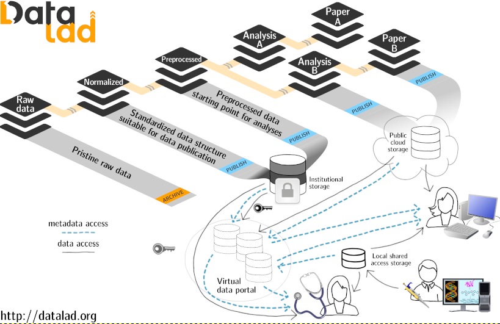

# Summary

DataLad is a Python-based tool for the joint management of code, data, and their relationship, built on top of a versatile system for data logistics ([git-annex](https://git-annex.branchable.com)) and the most popular distributed version control system ([Git](https://git-scm.com)).
It adapts principles of open-source software development and -distribution to address the technical challenges of data management, data sharing, and digital provenance collection across the life cycle of digital objects.
DataLad aims to make data management as easy as managing code.
It streamlines procedures to consume, publish, and update data, for data of any size or type, and to link them as precisely versioned, lightweight dependencies.
DataLad helps to make science more reproducible and FAIR [@FAIR2016].
It can capture complete and actionable process provenance of data transformations to enable automatic re-computation.
With a Python and a command-line interface, an infrastructure for software extensions, and complete independence from centralized services but development towards maximum interoperability with existing tools and services, the DataLad project ([datalad.org](http://datalad.org)) delivers a completely open, pioneering platform for flexible decentralized research data management (dRDM) [@Hanke_2021].
In order to maximize its utility and target audience, DataLad is available for all major operating systems, and can be integrated into established workflows and environments with minimal adjustments.

# Statement of Need

Code, data and computing environments are the core components of scientific projects.
While the collaborative development and use of research software and code is streamlined with established procedures and infrastructure, such as software distributions, distributed version control systems, and social coding portals like GitHub, other components of scientific projects are not as transparently managed or unobstructed accessible.
Data consumption is not as streamlined, as disconnected data portals require a large variety of different data access and authentication methods;
Reuse of data and other sizable or binary files is not as transparent, as data versioning is rarely performed, or nowhere close to the precision and inspectability that is standard in software development;
And scientific processes are not as reproducible, because data provenance, the information of how a digital file came to be, is often incomplete and rarely automatically captured.
Last but not least, without a notion of data packages, there is no easy let alone uniform way to declare discoverable data dependencies and derivative relationships between such packages.
DataLad aims to solve these issues by providing streamlined, transparent management of code, data, computing environments, and their relationship.
It provides targeted interfaces and interoperability adapters to established scientific and commercial tools and services to set up unobstructed, unified access to all elements of scientific projects, and it enables workflows that are particularly suited for reproducible science, such as actionable process provenance capture for arbitrary command execution that affords automatic re-execution.
To this end, it builds up on and extends two established tools for version control and transport logistics, Git and git-annex.

## Why Git and git-annex?

Git is the most popular version control system for software development[^1].
It is a distributed content management system, specifically tuned towards managing and collaborating on text files, and excels at making all committed content reliably and efficiently available to all clones of a repository.
At the same time, Git is not designed to efficiently handle large (e.g., over a gigabyte) or binary files [see, e.g., @opensource:git-binary].
This makes it hard or impossible to use Git directly for distributed data storage with tailored access to individual files.
Git-annex takes advantage of Git's ability to efficiently manage textual information to overcome this limitation.
File content managed by git-annex is placed into a managed repository annex, instead of committing it directly to Git.
Instead of the file content, git-annex only commits a compact reference that enables identification and association of a file name with the content.
Those file content references are typically based on a checksum of the content.
Using these identifiers, git-annex tracks content availability across all repository clones (local or remote), or external resources such as URLs pointing to individual files on the web.
Upon user request, git-annex automatically manages data transport to and from a local repository annex at a granularity of individual files.
With this simple approach, git-annex enables separate and optimized implementations for identification and transport of arbitrarily large files, using an extensible set of protocols, while retaining the distributed nature and compatibility with versatile workflows for versioning and collaboration provided by Git.

[^1]: https://en.wikipedia.org/wiki/Git#Adoption

## What does DataLad add to Git and git-annex?

<!-- MIH thinks: #1 nesting, #2 reproducible execution, #3 additional software adaptors for concrete services relevant for science -->

**Easy to use modularization.**
Research workflows impose additional demands for an efficient research data management (RDM) platform besides "version control" and "data transport".
Many research datasets contain millions of files, but a large number of files precludes placing datasets in their entirety into a single Git repository even if individual files are tiny in their size.
Partitioning such datasets into smaller subdatasets (e.g., one subdataset per each subject in the dataset comprising thousands of participants), and linking them seamlessly allows for scalable management.
Research datasets and projects can also be heterogeneous, comprising different data sources or evolving data across different processing stages.
Beyond scalability, modularization into homogeneous components also allows for the efficient reuse of a selected subset of datasets and for recording a derivative relationship between datasets.
Git's submodule mechanism allows to unambiguously link (versions of) individual repositories by nesting one into another, but Git operations must still be performed within each individual repository.
To achieve modularity without impeding usability, DataLad simplifies working with the resulting hierarchies of Git submodules via recursive operations across dataset boundaries.
With this, DataLad makes it trivial to operate on individual files deep in the hierarchy or entire sub-trees of datasets, providing a "mono-repo"-like user experience in datasets nested arbitrarily deep.
A testament of this is [datasets.datalad.org](http://datasets.datalad.org), created as the project's initial goal to provide a data distribution with unified access to already available public data archives in neuroscience, such as [crcns.org](http://crcns.org) and [openfmri.org](http://openfmri.org).
It is curated by the DataLad team, and provides, at the time of publication, streamlined access to over 250 TBs of data across a wide range of projects and archives in a fully modularized way.

**"Re-executable" annotation of changes.**
Digital provenance is crucial for the trustworthiness and reproducibility of a research result, and contributes to the principle of "reusability" of the FAIR principles [@FAIR2016].
Git captures provenance with annotations of file changes, where changes are typically represented by a patch (an exact difference between two versions that could be applied to another version of the text file), and a Git commit message (a freeform, human-readable text description of the introduced changes).
Unlike changes to text documents or source code, which are typically done "manually", data manipulations are most often performed by software.
DataLad exploits this fact and enables automated annotation of changes which result from running an external command.
DataLad creates a commit message which does not only include a human-readable summary, but also a human- and machine-readable record of the command invocation which introduced the changes.
This allows for the data "change" to be re-executed to either verify that results reproduce, or to apply such a "change" to a completely different state, irrespective of the quality of the human-made commit message.

<!--AW:removed the sentence below as YOH suggested
Such annotation is not sufficient to introduce changes by following the description, if they cannot be completely represented by such a patch. -->
<!-- YOH: may be strip above sentence away... I am just trying to lead somehow into "semantic" description of the change.
  E.g. that if author was very good with the description of change, some smart AI could have redone it following the description
  and not the patch.  The simplest analog could be "replaced word X with Y" where the patch would contain exact difference, but
  either will not be applicable or just would miss some Xs if applied to a vastly different version -->

**Targeted interfaces and interoperability adapters.**
Interoperability with scientific or commercial services and hosting services allows researchers to integrate data management routines into their established workflows with only minimal adjustments, but Git and git-annex do not provide all required interoperability out of the box.
Git can interact with other repositories on the file system or accessible via a set of standard (ssh, http) or custom (Git) network transport protocols.
DataLad implements support for interactions with non Git-aware but commonly used portals via custom Git transfer protocols, as, e.g., it was done for interactions with the Open Science Framework (OSF) in the DataLad extension ``datalad-osf`` [@datalad-osf:zenodo].
Git-annex provides access to a wide range of external data storage resources via various protocols but cannot implement all idiosyncrasies of any individual data portal.
In particular, scientific data is frequently stored in compressed archives, and/or on specialized servers, such as XNAT ([www.xnat.org](http://www.xnat.org)).
Efficient scientific data processing therefore usually requires seamless access to a wide variety of different stores of scientific data.
To address this requirement, git-annex established a protocol [@git-annex:special_remotes_protocol] through which external tools can provide custom transport functionality transparently to the git-annex user.
This allows DataLad and many other projects to facilitate access to an ever-growing collection of resources [@git-annex:special_remotes] and to overcome technological limitations (e.g., maximal file sizes, or file system inode limits).

# Overview of the DataLad and its ecosystem

## Design principles

Besides the free software nature and open processes of the DataLad project, the development of DataLad is guided by four principles to ensure its open and domain agnostic nature, to maximize the long-term utility of its datasets and to minimize users' technical debt:

- Datasets and the files they comprise are the only two recognized entities
- A dataset is a Git repository with an *optional* annex
- Minimization of custom procedures and data structures
- Complete decentralization, with no required central server or service, but maximum interoperability with existing 3rd-party resources and infrastructure

In conjunction, these principles aim to reduce the risk of adoption for DataLad users. 
They foster the resilience of an ecosystem using DataLad datasets as a standard package format for any digital objects by avoiding any critical dependency on service deployments governed by central entities, and even on DataLad itself, for access to any resources managed with DataLad.

## DataLad core

The `datalad` Python package provides both a Python library and a command line tool which expose core DataLad functionality to fulfill a wide range of dRDM use cases for any domain.
All DataLad commands operate on *DataLad datasets*.
On a technical level, these datasets are Git repositories with additional metadata.
On a conceptual level, they constitute an overlay structure that allows to version control files of any size, track and publish files in a distributed fashion, and record, publish, and execute actionable provenance of files and file transformations.
\autoref{fig:one} summarizes key commands and concepts for local or distributed data and provenance management.

![Schematic overview of a dataset, datasets nesting, and selected commands for content and dataset management. A more comprehensive cheatsheet is provided in the DataLad handbook [@datalad-handbook:cheatsheet]. \label{fig:one}](figures/fig1.png)

DataLad's features can be flexibly integrated into standard scientific workflows.
For example, by using the concept of dataset nesting to modularize the evolution of a research project, DataLad can fulfill the YODA principles for reproducible science [@yoda:myyoda], and, with this simple paradigm, facilitate efficient access, composition, scalability, reuse, sharing, and reproducibility of results (see \autoref{fig:two}).
With core commands that aim to simplify and streamline version control operations across the two underlying version control tools Git and git-annex, DataLad also makes version control workflows less complex for data management novices.

## Extensions

Like Git and git-annex, DataLad core does not only provide a generic tool, that is unencumbered by a specific field of science or domain, it also establishes the foundation to build specialized solutions on top of it.
"DataLad extensions", stand-alone Python packages with additional DataLad functionality, provide a  mechanism to harmoniously extend DataLad's with a domain or technology specific functionality.
A dedicated [datalad-extension-template](https://github.com/datalad/datalad-extension-template) repository provides a starting point for creating new DataLad extensions.
Some exemplar established extensions include:

- [datalad-container](https://github.com/datalad/datalad-container) [@datalad-container:zenodo] to simplify management and use of Docker and Singularity containers typically containing complete computational environments;
- [datalad-crawler](https://github.com/datalad/datalad-crawler) [@datalad-crawler:zenodo] the functionality which initiated the DataLad project - to automate creation and updates of DataLad datasets from external resources;
- [datalad-neuroimaging](https://github.com/datalad/datalad-neuroimaging) [@datalad-neuroimaging:zenodo] to provide neuroimaging-specific procedures and metadata extractors;
- [datalad-osf](https://github.com/datalad/datalad-osf/) [@datalad-osf:zenodo] to collaborate using DataLad through the Open Science Framework (OSF).

The same mechanism of extensions is used for rapid development of new functionality to later be moved into the main DataLad codebase (e.g., [datalad-metalad](https://github.com/datalad/datalad-metalad/)).
The [datalad-extensions](https://github.com/datalad/datalad-extensions/) repository provides a list of extensions and continuous integration testing of their released versions against released and development versions of the DataLad core. 

## External uses and integrations

[comment1]: <> (TODO: probably here cite some examples of scientific papers in the wild which used DataLad)

DataLad can be used as an independent tool as used by scientists to access and/or manage data (see e.g. @Wittkuhn_2021, @datasets:LAAC-LSCP),
or as a core technology behind another tool or a larger platform.
[TemplateFlow](http://templateflow.github.io/) [@Ciric_2021] uses DataLad for the management of existing and orchestration of new submissions of neuroimaging templates.
[OpenNeuro](http://openneuro.org) uses DataLad for data logistics with data deposition to a public S3 bucket.
[CONP-PCNO](https://github.com/CONP-PCNO/) adopts aforementioned features for modular composition and nesting to deliver a rich collection of datasets with public or restricted access to data.
[ReproMan](http://reproman.repronim.org) integrates with DataLad to provide version control and data logistics.
[www.datalad.org/integrations.html](https://www.datalad.org/integrations.html) provides a more complete list of DataLad usage and integration with other projects, and @Hanke_2021 provides a systematic depiction of DataLad as a system for decentral research data management (dRDM) used by a number of projects.

## Documentation

Developer-focused technical documentation at [docs.datalad.org](http://docs.datalad.org), with detailed descriptions of the command line and Python interfaces, is automatically generated from the DataLad core repository.
A comprehensive [handbook](http://handbook.datalad.org) [@datalad-handbook:zenodo] provides user-oriented documentation with an introduction to research data management, and numerous use case descriptions for novice and advanced users of all backgrounds [@datalad-handbook:use-cases].

## Installation

The handbook provides [installation instructions](http://handbook.datalad.org/r.html?install) for all major operating systems.
DataLad releases are distributed through [PyPI](https://pypi.org/project/datalad), [Debian](https://tracker.debian.org/pkg/datalad), [NeuroDebian](http://neuro.debian.net/pkgs/datalad.html), [brew](https://formulae.brew.sh/formula/datalad), and [conda-forge](https://anaconda.org/conda-forge/datalad).
The [datalad-installer](https://github.com/datalad/datalad-installer) (also available from PyPI) streamlines the installation of DataLad and its dependencies, in particular git-annex, across a range of deployment scenarios, such as continuous integration systems, or high-performance computing (HPC) environments.

## Development

DataLad has been developed openly in a public repository ([github.com/datalad/datalad](https://github.com/datalad/datalad)) since its inception in 2013.
At the time of this publication, the repository amassed over 13.5k commits, 2.5k merged PRs, and 2.3k closed (+700 open) issues from over 30 contributors.
Issue tracker, labels, milestones, and pull requests are used to coordinate development.
The development process of DataLad is not isolated from its foundational building blocks.
For every new feature or bug fix the most appropriate software layer is determined to maximize the size of the benefitting user base and, importantly, also the associated developer audience.
This strategy aims to achieve a robust integration with the larger open source software ecosystem, and simultaneously minimize the total technical debt carried solely by the DataLad development team.
Consequently, DataLad development is tightly connected to and involves constant communication with the git-annex project and its main developer Joey Hess [@git-annex:projects-datalad].
To guarantee robust operation across various deployments, DataLad heavily utilizes continuous integration platforms (Appveyor, GitHub actions, and Travis CI) for testing DataLad core, building and testing git-annex (in a dedicated [github.com/datalad/git-annex](https://github.com/datalad/git-annex)), and integration testing 
with DataLad extensions ([datalad-extensions](https://github.com/datalad/datalad-extensions/)).

## Contributions

DataLad is free and open source software and encourages unconstrained use and re-use in any context.
Therefore, DataLad is released under [DFSG](https://en.wikipedia.org/wiki/Debian_Free_Software_Guidelines)- and [OSI](https://opensource.org/osd)-compliant MIT/Expat license.
License terms for reused components in the code-base are provided in the [COPYING](https://github.com/datalad/datalad/blob/master/COPYING) file.
The project aims to promote contributions rather than detached developments in forks and anyone is highly welcome to contribute to DataLad in any form under these terms.
Technical and procedural guidelines for such contributions can be found in the [CONTRIBUTING.md](https://github.com/datalad/datalad/blob/master/CONTRIBUTING.md) file shipped within DataLad's source repository.
Contributors are acknowledged on the project website, and also credited in the form of co-authorship in the zenodo-based archival of software releases.
All co-authors of this paper as well as the contributors acknowledged below have added to the project with code- or non-code-based contributions, and we thank past, present, and future contributors of this community for their involvement and work.

[comment2]: <> (# Author Contributions: if desired/needed -- or drop altogether.)
<!-- BEN: Looks like drop to me. Don't see a value in listing number of commits
or whatever metric at a particular point in time.-->

# Conflicts of interest

There are no conflicts to declare.

# Acknowledgements

DataLad development was facilitated by a senior adviser Dr. James V. Haxby (Dartmouth College).
We express our gratitude to Joey Hess for the development and maintenance of git-annex, and for years of productive collaboration with the DataLad team.
We would like to extend our gratitude to 
Joey Zhou,
Matteo Visconti di Oleggio Castello,
John T. Wodder II,
Satya Ortiz-Gagné,
Jörg Stadler,
Andrew Connolly,
John Lee,
Nolan Nichols,
Elizabeth DuPre,
Cécile Madjar,
Gergana Alteva,
Timo Dickscheid,
Alex Waite,
[TODOADD: notable contributors]
for notable contributions to the codebase, bug reports, recommendations, and promotion of DataLad.

DataLad development was made possible thanks to support by 
NSF [1429999](http://www.nsf.gov/awardsearch/showAward?AWD_ID=1429999), 
[1912266](http://www.nsf.gov/awardsearch/showAward?AWD_ID=1912266) 
(PI: Halchenko) and BMBF 01GQ1411 and 01GQ1905 (PI: Hanke) 
through [CRCNS](https://www.nsf.gov/funding/pgm_summ.jsp?pims_id=5147) program.
It received significant contributions from ReproNim [1P41EB019936-01A1](https://projectreporter.nih.gov/project_info_details.cfm?aid=8999833&map=y) (PI: Kennedy) and DANDI [5R24MH117295-02](https://projectreporter.nih.gov/project_info_description.cfm?aid=9981835&icde=53349087) (PIs: Ghosh, Halchenko) NIH projects.
It also received contributions from the Canadian Open Neuroscience Platform and the NeuroHub (Co-PI: Poline) projects thanks in part to funding from a Brain Canada Platform Support Grant Competition Award in addition to funds and in-kind support from sponsor organizations, and from the Canada First Research Excellence Fund, awarded through the Healthy Brains, Healthy Lives initiative at McGill University, and the Brain Canada Foundation with support from Health Canada.
This development was supported by the European Regional Development Fund (Project: Center for Behavioral Brain Sciences Magdeburg, Imaging Platform), the European Union’s Horizon 2020 research and innovation programme under grant agreements [Human Brain Project (SGA3, H2020-EU.3.1.5.3, grant no. 945539)](https://cordis.europa.eu/project/id/945539), and [Virtual Brain Cloud (H2020-EU.3.1.5.3, grant no. 826421)](https://cordis.europa.eu/project/id/826421), the Deutsche Forschungsgemeinschaft (DFG, German Research Foundation) under grants [SFB 1451 (431549029)](https://gepris.dfg.de/gepris/projekt/431549029) and [IRTG2150 (269953372)](https://gepris.dfg.de/gepris/projekt/269953372).

# References
